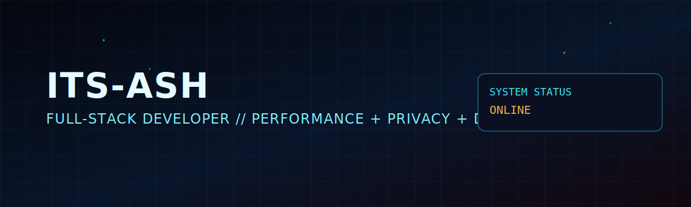

	

<h1 align="center">SYSTEM ONLINE // Ashvini Jangid</h1>

	Building products that stay fast, clear, and reliable at scale.

	

	
	
	
	
	

## Who I Am

- I ship practical software across frontend, backend, and developer tooling.
- I focus on performance, maintainability, and shipping speed without quality trade-offs.
- I prefer clear architecture, measurable outcomes, and low operational drag.

## Core Stack

	
	
	
	
	
	
	
	
	
	

## IoT & Edge

	
	
	
	
	
	
	

## Focus Areas

| Track | Mission |
|---|---|
| Frontend Systems | Accessible interfaces, meaningful motion, and production-grade performance tuning. |
| Backend Platforms | APIs and service boundaries designed for observability and predictable scaling. |
| Developer Experience | Tooling and CI guardrails that reduce friction and keep teams shipping. |

## Featured Build // Ash Tools

Ash Tools is a privacy-first workspace of browser tools for media, documents, and dev workflows.

- Local-first processing with WebAssembly and WebGPU.
- Built to run fast, with no upload required for sensitive files.
- Includes tools like Video Studio, Image Editor, PDF Merger, Regex Generator, and Code Sandbox.

Explore:

- Live platform: <a href="https://ash-tools.store/">ash-tools.store</a>
- Source code: <a href="https://github.com/its-ash/ash-tools">github.com/its-ash/ash-tools</a>

## Live Warp Gates

- Portfolio: <a href="https://its-ash.github.io/">its-ash.github.io</a>
- Projects: <a href="https://its-ash.github.io/project.html">its-ash.github.io/project.html</a>
- Resume: <a href="https://its-ash.github.io/resume.pdf">its-ash.github.io/resume.pdf</a>
- LinkedIn: <a href="https://www.linkedin.com/in/ashvinijangid/">linkedin.com/in/ashvinijangid</a>
- Email: <a href="mailto:ashvini.jangid@email.com">ashvini.jangid@email.com</a>

## GitHub Signal

	
	

	

